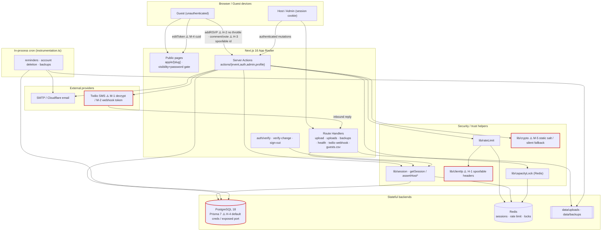

# RSVP to Me — Security & Code-Quality Remediation Plan

_Principal-engineer audit of the full repository. Self-contained: every claim is tied to a file path, line, and function._

---

## 1. Executive Summary

The codebase is, on balance, **healthier than average for its size**. It shows real security maturity: a documented SEC-1…SEC-21 remediation history with regression tests (`tests/regression/`), parameterised Prisma queries throughout (no raw SQL injection surface except one internal health query), magic-token hashing at rest, at-rest encryption of provider secrets, per-event capacity locking, CSRF-resistant `sameSite=lax` httpOnly session cookies, security headers, and SHA-pinned CI actions with `npm audit` gating.

The remaining risk is concentrated in a few areas:

1. **Trust-boundary weaknesses in rate limiting** — IP is derived from spoofable client headers by default, so every IP-keyed limiter (magic link, registration, event-password brute force, guest invites) is bypassable.
2. **Unauthenticated fan-out to email/SMS** — `addRSVP` sends a confirmation message to any attacker-supplied address with no throttle, and public events accept RSVPs from anyone; this is a spam/cost amplification vector under the app's own sending reputation and Twilio billing.
3. **Weak guest-identity model** — guest write actions authorise by matching a _publicly visible_ `rsvpId` + `guestName`, and guest edit authority rests on a `cuid()` token that is not a cryptographic secret.
4. **Two confirmed functional bugs in the SMS/Twilio credential path** that also have a security dimension (a broken decrypt check and a webhook validator that ignores DB-configured credentials).
5. **Deployment hardening gaps** — default weak DB/Redis passwords and host-exposed database ports in `docker-compose.yml`, plus a `script-src 'unsafe-inline'` CSP that undercuts XSS defence.
6. **Maintainability debt** — three "god files" (2.3k–5.1k lines) and ~15 copies of the co-host authorization check that should call the existing helper.

No critical, actively-exploitable RCE/SQLi/auth-bypass was found. The highest-priority items are High-severity abuse/bypass issues, not full compromises. Recommended focus order: fix the rate-limit trust boundary and unauthenticated fan-out first, then the credential-path bugs, then deployment hardening.

**Issue count:** Critical 0 · High 4 · Medium 8 · Low 7

---

## 2. Prioritized Findings

### 🔴 CRITICAL

None identified.

---

### 🟠 HIGH

---

#### H-1 — IP-based rate limiting is bypassable via spoofed forwarding headers

- **File / function:** `lib/clientIp.ts` → `getClientIp()` (lines 10–37)
- **Consumers:** `app/actions/auth.ts` (`sendMagicLinkAction` L27/L36, `registerHostAction` L85), `app/actions/event.ts` (`verifyEventPassword` L41–42, `inviteFriendAsGuest` L1824–25).
- **Problem:** When `TRUSTED_IP_HEADER` is unset (the default — `.env.example` ships it blank), the function trusts `cf-connecting-ip`, then `x-real-ip`, then `x-forwarded-for` directly from the request. Any client can send `X-Forwarded-For: <random>` on each request, producing a unique rate-limit key every time. This defeats:
  - magic-link send throttle (email/SMS bombing of any known user),
  - registration throttle,
  - **event-password brute force** (SEC-19's 10/10min cap becomes unlimited),
  - guest-invite spam cap (SEC-18).
- **Failure scenario:** Attacker scripts `POST verifyEventPassword` for a password-gated event, rotating `X-Forwarded-For` each request → bcrypt is the only slowdown, cap never trips → offline-speed online brute force.
- **Fix:** Only trust forwarding headers when an operator explicitly opts in, and take the _last_ untrusted hop, not the first. Also key sensitive limiters on a stable identifier (target email/slug) in addition to IP — several already do; ensure event-password also keys on something the attacker can't rotate freely.

```ts
// lib/clientIp.ts
export async function getClientIp(): Promise<string> {
  const headersList = await headers();

  // Only honor a forwarding header the operator has explicitly designated as
  // trusted (set behind a proxy that overwrites it). Absent that, do NOT trust
  // client-supplied XFF/x-real-ip/cf-connecting-ip — they are attacker-controlled.
  const trustedHeader = process.env.TRUSTED_IP_HEADER;
  if (trustedHeader) {
    const raw = headersList.get(trustedHeader);
    if (raw) {
      const parts = raw
        .split(",")
        .map((s) => s.trim())
        .filter(Boolean);
      // With a single trusted proxy, the client IP is the LAST entry it appended.
      if (parts.length > 0) return parts[parts.length - 1];
    }
  }
  return "127.0.0.1"; // no reliable IP; fall back to identifier-based limits
}
```

- **Docs:** Update `docs/admin/configuration.md` to state that IP rate limiting requires `TRUSTED_IP_HEADER` behind a trusted proxy, and is otherwise identifier-only.

---

#### H-2 — Unauthenticated `addRSVP` fan-out to arbitrary email/SMS with no rate limit

- **File / function:** `app/actions/event.ts` → `addRSVP(rawInput)` (lines 287–430); email/SMS sent at L406–426.
- **Problem:** `addRSVP` is callable by anyone for any PUBLIC/UNLISTED event (no session, no token). It upserts a `User` from the attacker-supplied `guestEmail`/`guestPhone` (L308–326) and fires `sendRsvpConfirmationEmail`/`sendRsvpConfirmationSms` to that address (L406–426). There is **no rate limiting** on this action, unlike `verifyEventPassword`, `inviteFriendAsGuest`, and the auth actions which all use `rateLimit()`.
- **Failure scenario:** Attacker loops `addRSVP({ eventId, guestName:"x", guestEmail: victim@... , status:"NO" })` → victim receives unlimited "RSVP confirmed" emails from your domain; or supplies phone numbers → unbounded Twilio spend. Also silently pre-creates `User` rows for arbitrary emails (account/enumeration pollution + auto-linking on later registration via `linkRsvpsToUser`).
- **Fix:** Add the shared limiter (same pattern as the rest of the file) keyed on IP + eventId, plus a per-target cap. Consider deduping/ignoring confirmation sends for repeated RSVPs to the same address.

```ts
// top of addRSVP, after parsing
const ip = await getClientIp();
const burst = await rateLimit(`rsvp:ip:${ip}`, 15, 600); // 15 / 10 min / IP
if (!burst.success) return { success: false, error: "Too many RSVPs. Try again later." };
const perEvent = await rateLimit(`rsvp:evt:${data.eventId}:${ip}`, 8, 600);
if (!perEvent.success) return { success: false, error: "Too many RSVPs for this event." };
```

- **Docs:** `docs/admin/configuration.md` (rate-limit table) and `docs/host/managing-rsvps.md` (note anti-abuse throttle).

---

#### H-3 — Guest identity for comments/votes/potluck is spoofable (public rsvpId + public name)

- **File / functions:** `app/actions/event.ts` → `addComment` (unauth branch L501–519), `claimPotluckItem` (L1136–1154), `unclaimPotluckItem` (L1197–1209), `castVote` (L2061–2074), `addPollOption` (L2162–2177).
- **Problem:** For unauthenticated guests these actions authorise by looking up an approved RSVP by `id` and then checking `rsvp.guestName === suppliedName`. **Both `rsvp.id` and `guestName` are shipped to every viewer** of the event page (`app/e/[slug]/page.tsx` L26–38 selects `id` and `guestName` for all approved RSVPs). So the "verified identity" check compares two values the attacker already has.
- **Failure scenario:** Any visitor reads the public guest list, picks approved guest "Alice" (`rsvpId`, `guestName`), and posts comments / casts poll votes / claims potluck items **as Alice**. The SEC-17/SEC-4 name match provides no real protection.
- **Fix:** Authorise unauthenticated guest writes with the secret `editToken` (which the guest holds and which is not published), not the public `rsvpId`. Verify the token maps to an approved RSVP for the event and derive `guestName` from that row server-side.

```ts
// instead of accepting guestRsvpId + guestName, accept editToken:
const rsvp = await db.rSVP.findFirst({
  where: { editToken, eventId: <eventId>, approved: true },
  select: { id: true, guestName: true },
});
if (!rsvp) return { success: false, error: "A valid RSVP is required." };
const guestName = rsvp.guestName; // never trust client-supplied name
```

- **Note:** This changes the client contract (pass token, not rsvpId) — update `components/rsvp/*` and `components/event/EventPage.tsx` call sites, and add a regression test alongside the existing `sec-17-comment-authz-spoofing.test.ts`.

---

#### H-4 — `docker-compose.yml` ships weak default credentials and exposes DB/Redis ports

- **File:** `docker-compose.yml` L8–9, L27–28 (`ports: 5432:5432`), L31 (`POSTGRES_PASSWORD:-postgres_password_here`), L44 (`REDIS_PASSWORD:-redis_password_placeholder`).
- **Problem:** If an operator brings up the stack without setting `POSTGRES_PASSWORD`/`REDIS_PASSWORD`, the containers start with **publicly-known literal passwords**, and Postgres (5432) and Redis (6379) are bound to the host. On any host without a separate firewall this is a directly reachable database with a known password.
- **Failure scenario:** `docker compose up` on a cloud VM with a public IP → attacker connects to `:5432` with `postgres/postgres_password_here` → full data read/write.
- **Fix:**
  1. Remove the `:-default` fallbacks so compose refuses to start without real secrets (or fail fast in an entrypoint check).
  2. Drop the host `ports:` mappings for postgres/redis in the production compose (services reach each other over the compose network); keep host exposure only in `docker-compose.dev.yml` if needed.

```yaml
postgres:
  environment:
    POSTGRES_PASSWORD: ${POSTGRES_PASSWORD:?POSTGRES_PASSWORD is required}
  # no host ports in production
redis:
  command: redis-server --requirepass ${REDIS_PASSWORD:?REDIS_PASSWORD is required}
```

- **Docs:** `docs/admin/installation.md` — require strong secrets before first boot; note ports are no longer host-exposed.

---

### 🟡 MEDIUM

---

#### M-1 — SMS Twilio token never decrypted (broken `enc:` check) — functional + credential bug

- **File / function:** `lib/sms.ts` → `resolveSmsConfig()` line 17.
- **Problem:** `const token = tokenEnc.startsWith("enc:") ? decryptConfig(tokenEnc) : tokenEnc;`. But `encryptConfig()` (`lib/crypto.ts` L14–26) produces `"<ivHex>:<tagHex>:<cipherHex>"` with **no `enc:` prefix**. So a DB-configured (encrypted) Twilio token is _never_ decrypted — the raw ciphertext is passed to `twilio(sid, token)`, so all SMS via admin-panel-configured Twilio fail auth. `lib/email.ts` (L76, L80–84) does this correctly by calling `decryptConfig(...)` unconditionally.
- **Fix:** Mirror email.ts — call `decryptConfig` directly (it already no-ops on non-encrypted values via the `includes(":")` check):

```ts
const tokenEnc = configMap.twilio_auth_token || process.env.TWILIO_AUTH_TOKEN || "";
const token = decryptConfig(tokenEnc) || tokenEnc;
```

- **Docs:** `docs/admin/sms.md` — note tokens are stored encrypted and decrypted at send time.

---

#### M-2 — Twilio inbound webhook validates signature only against env token, ignoring DB config

- **File / function:** `app/api/webhooks/twilio/route.ts` → `validateTwilioSignature()` line 15.
- **Problem:** Uses `process.env.TWILIO_AUTH_TOKEN` exclusively. The admin panel stores Twilio credentials in `SystemConfig` (encrypted). An operator who configures Twilio _only_ via the admin UI has no `TWILIO_AUTH_TOKEN` env var, so `validateTwilioSignature` returns `false` for every request → all inbound SMS RSVP replies get `403`. Fails closed (safe) but silently breaks a documented feature, and splits the credential source of truth.
- **Fix:** Resolve the auth token the same way `lib/sms.ts` does (DB config first, then env), then validate. Reuse a shared `resolveSmsConfig()`-style helper so there is one source of truth.
- **Docs:** `docs/admin/sms.md` — inbound webhook uses the same configured credentials as outbound.

---

#### M-3 — CSP allows `script-src 'unsafe-inline'`, undercutting XSS mitigation

- **File:** `next.config.ts` L23 (`script-src 'self' 'unsafe-inline'...`).
- **Problem:** `'unsafe-inline'` in `script-src` means any injected inline `<script>` executes, so the CSP provides little XSS protection. Given the app renders user-supplied strings widely (guest names, notes, comments, event text), a future markup-injection bug would not be contained.
- **Fix:** Move to a nonce-based CSP (Next.js supports per-request nonces via middleware) or hash-based allowlist, and drop `'unsafe-inline'` from `script-src`. Keep `'unsafe-inline'` for `style-src` only if strictly required by Radix/inline styles (prefer nonces there too over time).
- **Docs:** `docs/admin/configuration.md` — document CSP behaviour and any nonce requirements for custom embeds.

---

#### M-4 — Guest edit authority rests on a `cuid()` `editToken`, not a cryptographic secret

- **File:** `prisma/schema.prisma` L284 (`editToken String @unique @default(cuid())`); consumed in `app/actions/event.ts` `updateRSVP` (L609–612), `inviteFriendAsGuest` (L1830), and `app/e/[slug]/page.tsx` token bypass (L107–112).
- **Problem:** `cuid()` values embed a timestamp and monotonic counter; they are collision-resistant but **not designed to be unguessable secrets**. `editToken` is the sole credential for editing an RSVP and for bypassing the PRIVATE-event gate, and it travels in URLs/SMS/Referer. A predictable token weakens both.
- **Fix:** Generate `editToken` from a CSPRNG (e.g. `randomBytes(32).toString("hex")`) at RSVP creation instead of `cuid()`. Backfill is optional; new tokens close the gap. Keep the `@unique` constraint.
- **Docs:** `docs/host/managing-rsvps.md` / `docs/host/inviting-guests.md` — note edit links are secret.

---

#### M-5 — Encryption uses a hard-coded static salt and silent decrypt-failure fallback

- **File / function:** `lib/crypto.ts` → `getEncryptionKey()` L6–12 (static salt `"rsvp-to-me-salt"`), `decryptConfig()` L49–52 (returns raw ciphertext on failure).
- **Problem:** (a) A fixed salt means the KDF output is fully determined by the secret alone — acceptable for a single app but removes defence against precomputation and cross-instance key reuse. (b) On any decrypt error `decryptConfig` returns the _encrypted_ string verbatim, which can then be silently used as a live credential (see M-1 interaction) or written back, masking corruption/misconfiguration.
- **Fix:** Derive the key with a per-deployment random salt stored alongside ciphertext (or at least document that rotating `ENCRYPTION_KEY` invalidates stored secrets). Make `decryptConfig` throw/return `""` on failure rather than echoing ciphertext, and have callers treat that as "not configured".
- **Docs:** `docs/admin/configuration.md` — key rotation and encryption behaviour.

---

#### M-6 — Host `inviteGuest` fan-out loop has no rate limit or batch cap

- **File / function:** `app/actions/event.ts` → `inviteGuest(eventId, emailOrPhone)` L1679–1810.
- **Problem:** Splits a comma list and sends email/SMS per entry (L1759–1792) with no cap on list size and no `rateLimit()` (unlike the guest-facing `inviteFriendAsGuest`). A compromised/abusive host session can drive large blasts and Twilio spend. Lower severity than H-2 because it requires an authenticated host, but hosts are a lower trust tier than admins.
- **Fix:** Cap entries per call (e.g. 100) and add a per-host/per-event `rateLimit()` window mirroring `inviteFriendAsGuest`.
- **Docs:** `docs/host/inviting-guests.md` — document invite limits.

---

#### M-7 — `saveEventField` / inline edits gated to host-only, but other edits allow co-hosts (inconsistent authz)

- **File / function:** `app/actions/event.ts` → `saveEventField` (L116–139), `saveEventLocation` (L143–169), `saveEventTheme` (L173–204), `addInfoSection` (L208–235), `saveCoverImage`/`removeCoverImage` (L893–910) all call `assertHost` (owner/admin only), whereas `addRsvpField`/`reorderRsvpFields`/poll actions call `assertHostOrCohost`.
- **Problem:** Not a vulnerability per se, but the inconsistent trust model is easy to get wrong on the next change and contradicts the documented co-host capability. `updateInfoSection` (L237–265) and several delete actions also hand-roll the owner/admin check inline (missing co-host), so co-hosts can _add_ an info section but not _edit/delete_ it.
- **Fix:** Decide the intended co-host capability set, then route every event-scoped mutation through `assertHost` or `assertHostOrCohost` consistently. Replace the ~15 inline `hostId === session.userId || role === ADMIN` checks with the helper.

---

#### M-8 — Health endpoint is unauthenticated and leaks migration/DB state

- **File / function:** `app/api/health/route.ts` → `GET()` L4–26.
- **Problem:** Returns `{status: "degraded", migrations: "pending"|"unreachable"}` publicly. Minor information disclosure about deploy/DB state useful for timing attacks on deploys. It's also a raw `$queryRaw` (the only raw query) — safe here (no interpolation) but worth noting.
- **Fix:** Return a minimal `200/503` with no internal detail for unauthenticated callers, or gate the detailed body behind an internal network/health token. Keep the liveness signal simple.
- **Docs:** `docs/admin/installation.md` (health check section).

---

### 🟢 LOW

---

#### L-1 — `updateInfoSection` always nulls `title` and drops co-host access

- **File:** `app/actions/event.ts` `updateInfoSection` L237–265 (sets `title: null` unconditionally L254; inline host-only check L245–247). Confirm intended; if `title` is deprecated, remove it from the write rather than forcing null on every edit.

#### L-2 — Massive duplicated blast-filter logic

- **File:** `app/actions/event.ts` `sendBlast` (L746–762) and `sendSmsBlast` (L804–820) are near-identical filter builders. Extract a shared `buildRsvpStatusFilter(filters)` helper.

#### L-3 — God-files hurt reviewability and testability

- **Files:** `app/actions/event.ts` (2349 lines), `components/event/EventPage.tsx` (~4747), `app/(app)/admin/AdminClient.tsx` (~5136), `components/event/SettingsPage.tsx` (~3408). Split by feature (RSVP, polls, potluck, comments, co-hosts) — smaller units are easier to audit and unit-test.

#### L-4 — Silent error swallowing via `.catch(() => {})`

- **File:** `app/actions/event.ts` (25+ occurrences, e.g. L137, L232, L404, L707). Acceptable for non-critical activity logging, but funnel through a shared `logSafe()` that at least records at debug level so failures aren't invisible.

#### L-5 — Twilio auth token held in client React state in the admin panel

- **File:** `app/(app)/admin/AdminClient.tsx` (`twilioAuthToken` state, ~L273). The server masks values as `••••••••` before sending (`app/actions/admin.ts` L306–308), so the real token should never reach the client — verify no code path returns the decrypted token to the browser, and keep the input a write-only field (submit only when changed).

#### L-6 — `.env.example` ships `HOST_INVITE_CODE="letmein"`

- **File:** `.env.example` L33. The startup guard (`lib/session.ts` `validateInviteCode` L26–49) rejects `letmein` only in production on non-localhost. Fine, but change the example to an obviously-placeholder value and reinforce in docs that it must be replaced.

#### L-7 — `generateUniqueSlug` unbounded retry loop

- **File:** `lib/slug.ts` `generateUniqueSlug` L13–24. `while(true)` with sequential suffixes does one query per attempt; under heavy slug contention this is O(n) queries. Low impact; add a random suffix after a few collisions to bound it.

---

## 3. Cross-Cutting Strengths (keep doing this)

- Prisma everywhere → no SQL injection surface in user paths; the single `$queryRaw` (health) has no interpolation.
- Magic tokens hashed at rest (`lib/hash.ts`), TTL-bounded, single-use, length-capped, invalidated on reissue.
- Session cookie is `httpOnly` + `secure` (prod) + `sameSite=lax`, backed by DB rows and Redis with role re-sync.
- Redirect safety validated twice (`lib/auth.ts isSafeRedirect`, re-checked in `verify/route.ts`).
- Capacity race closed with a Redis per-event lock re-counting inside the lock (`lib/capacityLock.ts`, `addRSVP`, `updateRSVP`).
- SSRF guard on Cloudflare worker URLs (`lib/email.ts isSafeWorkerUrl`), CSV formula-injection neutralised (guests.csv), TwiML XML-escaped, mass-assignment blocked by `SaveEventSettingsSchema`.
- Upload route validates magic-bytes (not just MIME), caps size, randomises filenames; serve route uses `path.basename` + `nosniff`.
- CI pins actions by SHA, runs `npm audit --audit-level=high`, prettier, lint, and 4 test tiers; Dependabot enabled.

---

## 4. Suggested Remediation Order

1. **H-1** (rate-limit trust boundary) and **H-2** (addRSVP fan-out) — highest abuse exposure, small diffs.
2. **M-1 / M-2** (SMS/Twilio credential bugs) — correctness + credential integrity, tiny fixes.
3. **H-3 / M-4** (guest identity + editToken) — coordinated change to guest auth contract.
4. **H-4 / M-3 / M-8** (deployment + CSP + health hardening) — infra, no app-logic risk.
5. **M-5, M-6, M-7** then the Low items / refactors.

Per repo policy (`AGENTS.md`), each fix needs a `docs/admin/` update (and `docs/host/` where guest-facing) plus a regression test in `tests/regression/` mirroring the SEC-\* convention.

---

## 5. Architecture Diagram (current state + improvement points)



**Structural improvement targets highlighted above:**

- **Trust boundary (H-1):** make `lib/clientIp` the single, hardened source of caller identity; never trust unverified proxy headers.
- **Guest write path (H-2, H-3, M-4):** funnel all guest mutations through one throttled, token-authenticated gateway that derives identity server-side instead of trusting public ids/names.
- **Credential path (M-1, M-2, M-5):** unify Twilio/SMTP credential resolution and decryption in one helper used by both outbound senders and the inbound webhook.
- **Authorization (M-7):** collapse the ~15 inline host/co-host checks into `assertHost` / `assertHostOrCohost`.
- **Deployment (H-4, M-3):** remove default secrets and host-exposed DB ports; tighten CSP to nonce-based.
- **Modularity (L-3):** break the god-files into feature modules to shrink the audit/blast surface of every future change.

```

```
