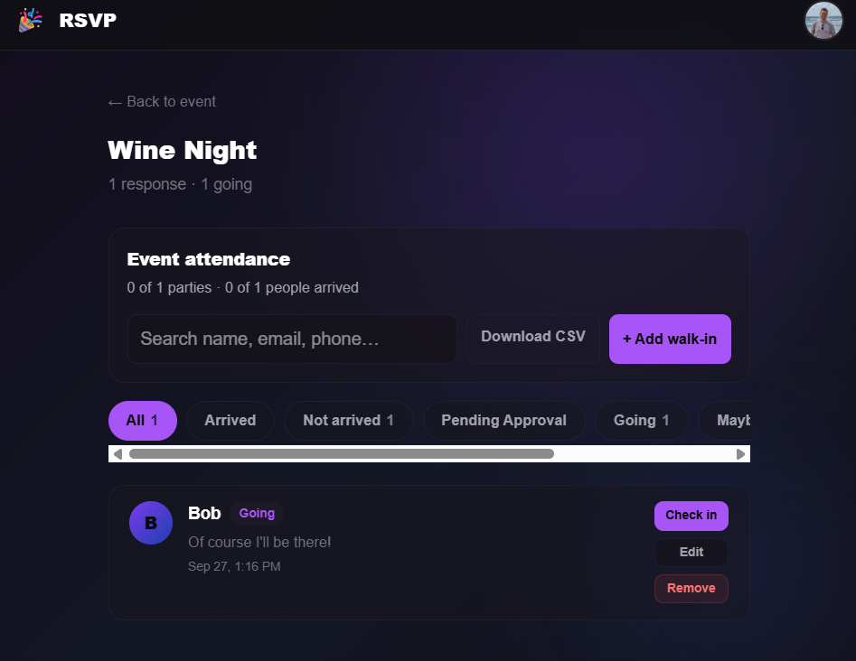

# Your Guest List

The guest list (at `/e/[slug]/guests`) is where you see who's coming and manage everyone in one place.

The **Guests** card on your event page is always visible to you and your co-hosts, even before the
first RSVP arrives. Use **View all →** to open the full guest list, or use the settings cog to jump
directly to RSVP settings.

## Guest Management Preview

Track responses and arrivals, check in guests, add walk-ins, and export the guest list from one view.

---

## Filters

Filter the list by status to focus on what matters:

- **All** — everyone associated with the event, including invited guests who have not responded
- **Going**, **Maybe**, **No**
- **Invited** — invited but not yet responded
- **Awaiting Approval** — pending your approve/decline

Hosts and co-hosts can also search by guest name, email, phone, or named plus-one and filter the
list to **Arrived** or **Not arrived** parties.

---

## Event Check-In and Walk-Ins

Every RSVP record has a **Check in** button, including guests who have not replied, answered
**Can't make it**, or are awaiting approval. This lets the host accept walk-ins and last-minute
changes of plan at the door without changing the guest's RSVP first. A check-in covers the primary
guest and every plus-one on that RSVP. The attendance summary updates immediately with both party
progress and total people arrived. Use **Undo check-in** and confirm inline if you tapped the wrong
party; checking the party in again records a new arrival time.

Use **+ Add walk-in** when someone arrives without an RSVP. Enter their name, total party size, and
optionally an enabled email or SMS contact. The host-only action creates an approved Going RSVP and
checks the party in without sending a message. If the contact matches an existing RSVP, that party
is checked in instead of creating a duplicate.

Unanswered invitees also have a **Resend invite** action. It sends a fresh invitation through the
original email or SMS destination while retaining the normal delivery validation, rate limits, and
activity history. If an older invitation record is no longer connected to an RSVP, you can remove
that invitation history without removing the guest's RSVP; a later RSVP with the same email or
phone reconnects the invitation automatically.

Check-in changes appear immediately on the device making them. Other open host devices see the
latest attendance after refreshing.

---

## Who Can See the Guest List

Choose how much guests can see in Settings:

- **Everyone can see** — any visitor can view the list.
- **Going guests only** — visible to your guests (anyone who has RSVP'd or opened their personal invite link) and to you and your co-hosts. Anonymous visitors who just have the link can't see it.
- **Host only** — hidden from guests; visible to you and your co-hosts.

This setting is enforced on the server, not just hidden in the page — with **Going guests only** or **Host only**, the restricted list is never sent to a browser that shouldn't see it, including on the dedicated guest-list page at `/e/[slug]/guests`.

RSVP activity follows the same privacy setting. New, changed, deleted, and invited-guest activity
entries can include a guest's name or RSVP note, so the server omits those entire entries whenever
the viewer cannot see the guest list. Check-in, undo, and walk-in activity remains organizer-only
regardless of the guest-list setting.

If your event is **Private** or password-protected, the guest list is gated the same way as the event page — a visitor who hasn't been let in can't reach it, regardless of the setting above.

**Guests' personal details stay private.** Even when the list is visible to guests, contact information (email, phone) and the per-guest edit links are shown **only to you and your co-hosts**. Guests see names and RSVP status, never each other's contact details or private questionnaire answers.

---

## Guest-facing RSVP Display

Open **Settings → Display Options → Guest-facing RSVP display**, directly below
**Guest list visibility**. Going, Maybe, and Can't make it each have their own
group of display controls and an interactive guest preview with example responses.

**These settings affect guests only. Hosts and co-hosts always see complete lists
and exact counts on the event page and in guest management.**

| Control               | Choice             | What guests see                                                                                                                                    |
| --------------------- | ------------------ | -------------------------------------------------------------------------------------------------------------------------------------------------- |
| Guest names           | Show immediately   | Names appear when the page opens.                                                                                                                  |
| Guest names           | Show after a click | A collapsed heading opens the names. On the full guest list, selecting that response filter reveals them; All starts with only the expanded lists. |
| Guest names           | Do not display     | That response type, its names, and its count are omitted from guest-facing lists.                                                                  |
| Count shown to guests | Exact count        | The actual number appears beside the response type.                                                                                                |
| Count shown to guests | No count           | The response label appears without a number, even after opening the names.                                                                         |
| Count shown to guests | Limit to 3+        | Available for Can't make it: show 1 or 2, then 3+ for three or more responses, including after opening the list.                                   |

The count control disappears when you choose **Do not display**. Summary totals
and filter badges follow the same choices; the combined response total is omitted
when it would reveal a hidden or capped count. Guest names can still be counted
when a list is opened: these are presentation choices, not additional access rules.

For new events, Going and Maybe start expanded with exact counts. Can't make it
starts collapsed with no count. Existing events retain expanded lists and exact
counts until a host changes them.

**Guest list visibility** still decides who may access the list. When it is
**Host only**, guest display controls are disabled and retain their saved choices
for later. Changing display settings does not change any RSVP, available RSVP
buttons, capacity calculation, notification, check-in record, or CSV export.
Opening a collapsed list never submits or changes a guest's RSVP.

---

## CSV Export

Download your guest list as a spreadsheet for check-in lists, name tags, or your own records. The export includes these columns:

The export includes every RSVP record with these columns:

**Name, Email, Phone, Status, Plus Ones, Approved, event-local RSVP Date, event-local Check-In
Time, one column per questionnaire field, RSVP Date (UTC), and Check-In Time (UTC).**

Questionnaire columns follow the configured order. Missing answers and check-ins are blank, and
duplicate question labels are numbered so spreadsheet headers stay unique.

> Co-hosts and admins can download the export too.
